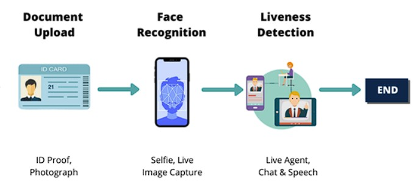

# eKYC 

## Update
- 7/12/2024: The source code has been rewritten and tested to be compatible with the VGGFace2 model (InceptionResnetV1). However, I have only tested it using Norm L2 for face matching.

----------------------------

eKYC (Electronic Know Your Customer) is a project designed to electronically verify the identity of customers. This is an essential system to ensure authenticity and security in online transactions.


eKYC (Electronic Know Your Customer) is an electronic customer identification and verification solution that enables banks to identify customers 100% online, relying on biometric information and artificial intelligence (AI) for customer recognition, without the need for face-to-face interactions as in the current process.

## eKYC flow 
This README provides an overview of the eKYC (Electronic Know Your Customer) flow, which comprises three main components: Upload Document (ID Card), Face Recognition (Verification), and Liveness Detection.



#### 1. Upload Document (ID Card)

Initially, users are required to upload an image of their ID card. This step is essential for extracting facial information from the ID card photo.

#### 2. Face Verification

Following the document upload, we proceed to verify whether the user matches the individual pictured on the ID card. Here's how we do it:

- **Step 1 - Still Face Capture**: Users are prompted to maintain a steady face in front of the camera.

- **Step 2 - Face Matching (Face Verification)**: Our system utilizes advanced facial recognition technology to compare the live image of the user's face with the photo on the ID card.

#### 3. Liveness Detection

To ensure the user's physical presence during the eKYC process and to prevent the use of static images or videos, we implement Liveness Detection. This step involves the following challenges to validate the user's authenticity:

- **Step 3 - Liveness Challenges**: Users are required to perform specific actions or challenges, which may include blinking, smiling, or turning their head.

- **Step 4 - Successful Liveness Verification**: Successful completion of the liveness challenges indicates the user's authenticity, confirming a successful eKYC process.

These combined steps—ID card upload, Face Verification, and Liveness Detection—comprehensively verify the user's identity, enhancing security and reducing the risk of fraudulent attempts.

## Installation
1. Clone the repository
```bash
git clone https://github.com/manhcuong02/eKYC
cd eKYC
```
2. Install the required dependencies
```bash
pip install -r requirements.txt
```

## Usage
1. Download weights of the [pretrained VGGFace models](https://drive.google.com/drive/folders/1-pEMok04-UqpeCi_yscUcIA6ytvxhvkG?usp=drive_link) from ggdrive, and then add them to the 'verification_models/weights' directory. Download weights and landmarks of the [pretrained liveness detection models](https://drive.google.com/drive/folders/1S6zLU8_Cgode7B7mfJWs9oforfAODaGB?usp=drive_link) from ggdrive, and then add them to the 'liveness_detection/landmarks' directory

2. Using the PyQt5 Interface:
```bash
python3 main.py
```

## Results

> [!Note]
> Due to concerns about my personal information, I have deleted the video result from my repo
# Machine Learning Driven Identity Verification

This repo contains a Jupyter Notebook that utilizes a Tensorflow Model to identity and smartly crop an Identity Card, along with an accompanying Flask app. The model was trained using a specially formatted version of the the MIDV-500 dataset where the images were converted from TIF to JPG and the extraneous metadata in the annotations removed. This model also works for isolating and cropping photos of paper receipts and possibly any conceivable rectangular images. To learn how to train the model see repo [KYC-train-model](https://github.com/getcontrol/KYC-train-model/).

# Installation Instructions

### Jupyter Notebook

1. Create and activate a Python 3 Virtual environment.

```python3 -m venv env```

```source env/bin/activate```

2. Install Requirements.

```pip install -r requirements.txt```

3. Start Jupyter Notebook.

```ipython notebook --ip=127.0.0.1```

4. Open & Run [Tensorflow - Verification.ipynb](https://github.com/getcontrol/tensorflow-verification/blob/master/Tensorflow%20-%20Verification.ipynb)

The mechanics of the Tensorflow model and OpenCV transforms is documented inline.

### Flask App
This demonstrates uploading the  identity document via a Flask app with the relevant pre-processing OpenCV steps. The machine learning model is optimized for images that are acquired via an Android or Samsung Phone. Use ngrok to share localhost URL for mobile browser testing.

Notes:

The Step 1 Form and Step 3 selfie or not fully functioning yet.

You must take a photo of ID card in Step 2 and selfie in Step 3 or app will break.

App.py behaves very similarily to the Jupyter Notebook , with a few exceptions documented as comments in the code.

1. Create and activate a Python 3 Virtual environment.

```python3 -m venv env```

```source env/bin/activate```

2. Install Requirements.

```pip install -r requirements.txt```

3. Start Flask app.

```python app.py```

4. In a separate terminal tab start ngrok.

```./ngrok http 5000```

5. Test ngrok URL on mobile browser. Final ID image is saved in tmp/FINAL.jpg.


#TODO

1. Connect Step 1 form to database
2. OCR ID Card and save JSON results to database
3. Compare ID Card image with selfie and save JSON results to database
4. Compare form submission and OCR results.


### Citation
Please cite this paper, if using midv dataset, link for dataset provided in paper

    @article{DBLP:journals/corr/abs-1807-05786,
      author    = {Vladimir V. Arlazarov and
                   Konstantin Bulatov and
                   Timofey S. Chernov and
                   Vladimir L. Arlazarov},
      title     = {{MIDV-500:} {A} Dataset for Identity Documents Analysis and Recognition
                   on Mobile Devices in Video Stream},
      journal   = {CoRR},
      volume    = {abs/1807.05786},
      year      = {2018},
      url       = {http://arxiv.org/abs/1807.05786},
      archivePrefix = {arXiv},
      eprint    = {1807.05786},
      timestamp = {Mon, 13 Aug 2018 16:46:35 +0200},
      biburl    = {https://dblp.org/rec/bib/journals/corr/abs-1807-05786},
      bibsource = {dblp computer science bibliography, https://dblp.org}
    }
